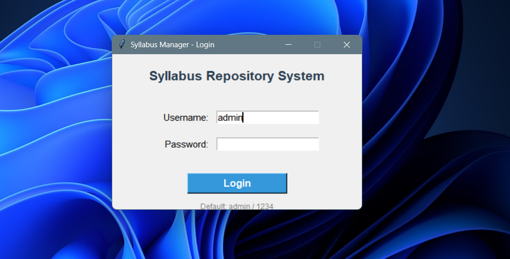
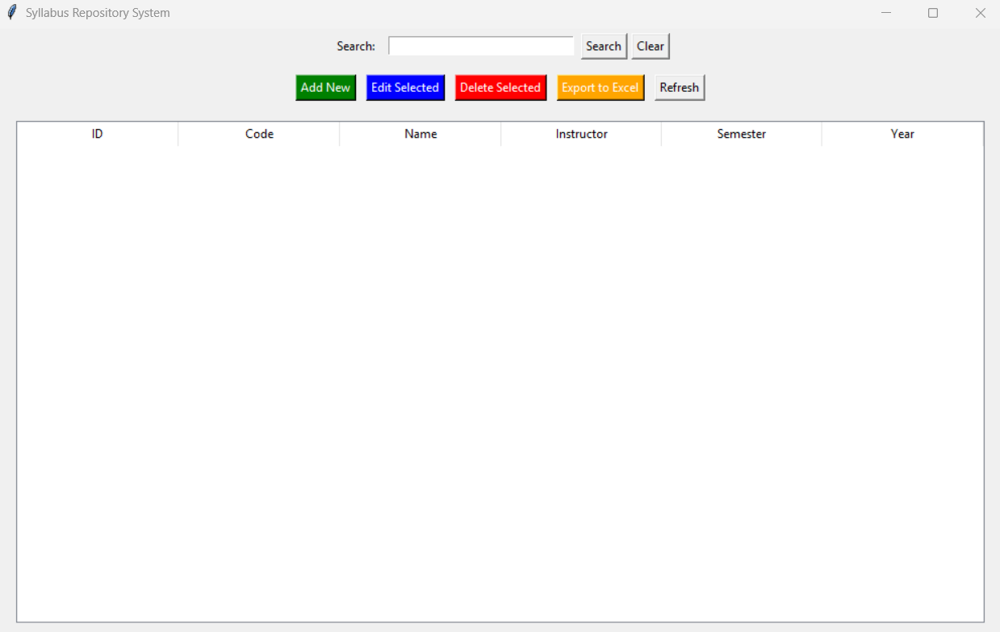
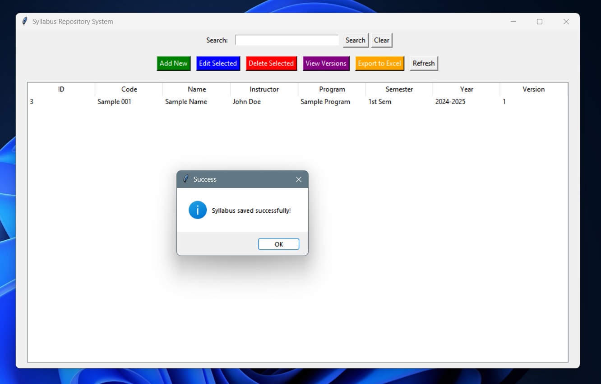
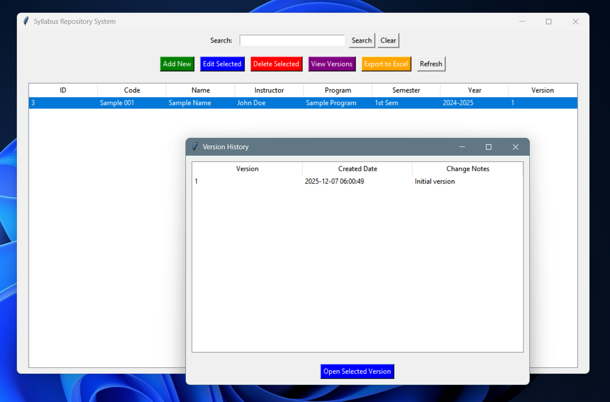

# Simple Syllabus Repository System

A lightweight, desktop-based **Syllabus Manager** built with Python and Tkinter.  
It allows faculty or academic departments to store, version-control, search, and export course syllabi (PDF files) with a clean GUI.

Perfect for small colleges, departments, or individual instructors who want a simple offline repository with version history.

---

### Features
- Add, edit, and delete syllabi
- Full **version control** – every update creates a new version with change notes
- View complete version history and open any previous PDF
- Search across Course Code, Name, Instructor, Program, Semester, etc.
- Double-click a row or right-click → delete to quickly manage entries
- Export all syllabi metadata to Excel (`syllabi_export.xlsx`)
- Simple login system (default: `admin` / `1234`)
- All data stored locally in SQLite (`data/syllabi.db`)
- PDF files stored in `data/pdfs/` with naming convention: `{id}_{code}_v{version}.pdf`

---

### Screenshots





---

### Requirements
```txt
Python 3.7+
tkinter (included with standard Python installation)
openpyxl >= 3.0.10